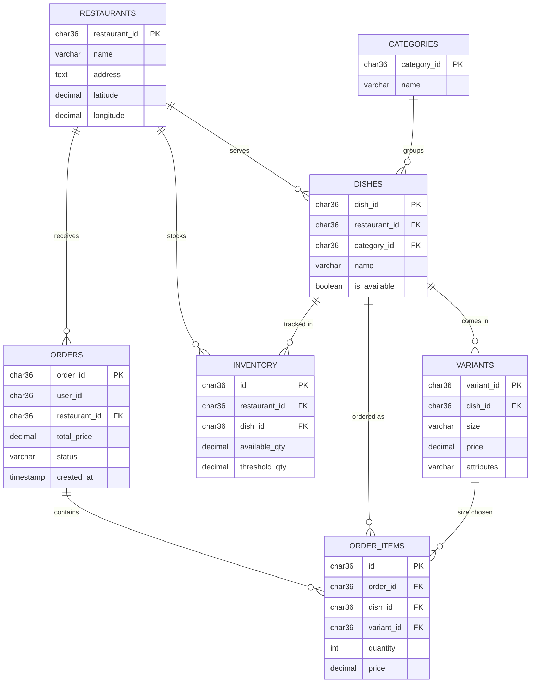

<div align="center">

# 🍽️ Restaurant Ordering Database

### A normalized MySQL schema for restaurants, menus, inventory, and customer orders


</div>

---

## 📑 Table of Contents

- [✨ Overview](#-overview)
- [🗂️ Project Structure](#️-project-structure)
- [🧱 Database Design](#-database-design)
- [📚 Table Reference](#-table-reference)
- [🚀 Quick Start](#-quick-start)
- [🔍 Example Queries](#-example-queries)
- [🛠️ Skills Demonstrated](#️-skills-demonstrated)
- [🗺️ Roadmap](#️-roadmap)
- [🤝 Contributing](#-contributing)

---

## ✨ Overview

This project is the database backbone for a **food-ordering platform** (think a simplified delivery or dine-in app). It models:

- 🏪 **Restaurants** with GPS coordinates
- 📋 **Menus**: dishes grouped into categories, each with multiple size/price **variants**
- 📦 **Inventory** tracking with low-stock thresholds
- 🧾 **Orders** and the individual **items** inside each order

All primary keys are `CHAR(36)` **UUIDs**, which suits distributed systems and APIs that generate IDs outside the database.

---

## 🗂️ Project Structure

```text
📦 restaurant-db-project
 ┣ 📜 restaurant.sql   ← Creates the database, all 7 tables, and foreign keys
 ┗ 📄 README.md        ← You are here
```

---

## 🧱 Database Design

### Entity-relationship diagram



### Domain at a glance

| Area | Tables | Purpose |
|------|--------|---------|
| 🍕 **Menu** | `restaurants`, `categories`, `dishes`, `variants` | What each restaurant sells and at what price |
| 📦 **Stock** | `inventory` | How much of each dish is available vs. its reorder threshold |
| 🧾 **Sales** | `orders`, `order_items` | What customers bought, from where, and when |

---

## 📚 Table Reference

<details>
<summary>🏪 <b>restaurants</b>: restaurant locations</summary>

| Column | Type | Notes |
|--------|------|-------|
| `restaurant_id` | `CHAR(36)` | Primary key (UUID) |
| `name` | `VARCHAR(255)` | Restaurant name |
| `address` | `TEXT` | Full address |
| `latitude` | `DECIMAL(10,8)` | GPS latitude |
| `longitude` | `DECIMAL(11,8)` | GPS longitude |

</details>

<details>
<summary>📋 <b>categories</b>: dish groupings (e.g. Starters, Mains)</summary>

| Column | Type | Notes |
|--------|------|-------|
| `category_id` | `CHAR(36)` | Primary key (UUID) |
| `name` | `VARCHAR(255)` | Category name |

</details>

<details>
<summary>🍝 <b>dishes</b>: menu items</summary>

| Column | Type | Notes |
|--------|------|-------|
| `dish_id` | `CHAR(36)` | Primary key (UUID) |
| `restaurant_id` | `CHAR(36)` | FK → `restaurants` |
| `category_id` | `CHAR(36)` | FK → `categories` |
| `name` | `VARCHAR(255)` | Dish name |
| `is_available` | `BOOLEAN` | Defaults to `TRUE`; lets you hide a dish without deleting it |

</details>

<details>
<summary>📏 <b>variants</b>: sizes and prices per dish</summary>

| Column | Type | Notes |
|--------|------|-------|
| `variant_id` | `CHAR(36)` | Primary key (UUID) |
| `dish_id` | `CHAR(36)` | FK → `dishes` |
| `size` | `VARCHAR(50)` | e.g. Small / Medium / Large |
| `price` | `DECIMAL(10,2)` | Menu price for this variant |
| `attributes` | `VARCHAR(255)` | Free-form extras (e.g. "spicy", "gluten-free") |

</details>

<details>
<summary>📦 <b>inventory</b>: stock levels</summary>

| Column | Type | Notes |
|--------|------|-------|
| `id` | `CHAR(36)` | Primary key (UUID) |
| `restaurant_id` | `CHAR(36)` | FK → `restaurants` |
| `dish_id` | `CHAR(36)` | FK → `dishes` |
| `available_qty` | `DECIMAL(10,2)` | Current stock |
| `threshold_qty` | `DECIMAL(10,2)` | Reorder level; low stock when `available_qty <= threshold_qty` |

</details>

<details>
<summary>🧾 <b>orders</b>: customer orders</summary>

| Column | Type | Notes |
|--------|------|-------|
| `order_id` | `CHAR(36)` | Primary key (UUID) |
| `user_id` | `CHAR(36)` | Customer ID (no `users` table in this schema, so no FK) |
| `restaurant_id` | `CHAR(36)` | FK → `restaurants` |
| `total_price` | `DECIMAL(10,2)` | Order total |
| `status` | `VARCHAR(50)` | e.g. placed / preparing / delivered |
| `created_at` | `TIMESTAMP` | When the order was placed |

</details>

<details>
<summary>🛒 <b>order_items</b>: line items within an order</summary>

| Column | Type | Notes |
|--------|------|-------|
| `id` | `CHAR(36)` | Primary key (UUID) |
| `order_id` | `CHAR(36)` | FK → `orders` |
| `dish_id` | `CHAR(36)` | FK → `dishes` |
| `variant_id` | `CHAR(36)` | FK → `variants` |
| `quantity` | `INT` | Units ordered |
| `price` | `DECIMAL(10,2)` | Price charged per unit at order time |

</details>

---

## 🚀 Quick Start

**1️⃣ Clone the repo**

```bash
git clone https://github.com/<your-username>/<your-repo>.git
cd <your-repo>
```

**2️⃣ Create the database**

```bash
mysql -u <user> -p < restaurant.sql
```

> ⚠️ The script begins with `DROP DATABASE IF EXISTS restaurant_db;`, so running it **deletes any existing `restaurant_db`**. Don't run it against a database you want to keep.

**3️⃣ Verify**

```sql
USE restaurant_db;
SHOW TABLES;
-- Expected: categories, dishes, inventory, order_items, orders, restaurants, variants
```

---

## 🔍 Example Queries

These queries run against the schema once you've added some data.

<details>
<summary>📋 <b>Full menu of available dishes</b></summary>

```sql
SELECT r.name AS restaurant, c.name AS category, d.name AS dish, v.size, v.price
FROM dishes d
JOIN restaurants r ON r.restaurant_id = d.restaurant_id
JOIN categories  c ON c.category_id   = d.category_id
JOIN variants    v ON v.dish_id       = d.dish_id
WHERE d.is_available = TRUE
ORDER BY r.name, c.name, d.name, v.price;
```

</details>

<details>
<summary>⚠️ <b>Low-stock alert</b></summary>

```sql
SELECT r.name AS restaurant, d.name AS dish, i.available_qty, i.threshold_qty
FROM inventory i
JOIN restaurants r ON r.restaurant_id = i.restaurant_id
JOIN dishes      d ON d.dish_id       = i.dish_id
WHERE i.available_qty <= i.threshold_qty
ORDER BY i.available_qty;
```

</details>

<details>
<summary>💰 <b>Revenue per restaurant</b></summary>

```sql
SELECT r.name AS restaurant,
       COUNT(o.order_id)             AS total_orders,
       COALESCE(SUM(o.total_price), 0) AS revenue
FROM restaurants r
LEFT JOIN orders o ON o.restaurant_id = r.restaurant_id
GROUP BY r.restaurant_id, r.name
ORDER BY revenue DESC;
```

</details>

<details>
<summary>🏆 <b>Top 5 best-selling dishes</b></summary>

```sql
SELECT d.name AS dish, SUM(oi.quantity) AS units_sold
FROM order_items oi
JOIN dishes d ON d.dish_id = oi.dish_id
GROUP BY d.dish_id, d.name
ORDER BY units_sold DESC
LIMIT 5;
```

</details>

---

## 🛠️ Skills Demonstrated


- Normalizing a menu into dishes, categories, and size/price variants
- Modeling one-to-many relationships with named foreign-key constraints
- Separating order headers (`orders`) from line items (`order_items`)
- Using UUIDs as primary keys

---

## 🗺️ Roadmap

Planned improvements:

- [ ] Add sample data (`INSERT` statements) for restaurants, dishes, and orders
- [ ] Add indexes on foreign-key and filter columns (`status`, `created_at`)
- [ ] Add a `users` table and connect `orders.user_id` to it
- [ ] Add `NOT NULL` and `CHECK` constraints (e.g. `price >= 0`, `quantity > 0`)
- [ ] Add reporting views (daily sales, low-stock list)
- [ ] Add practice questions with solutions

---

## 🤝 Contributing

Contributions are welcome:

1. 🍴 Fork the repo
2. 🌿 Create a branch (`git checkout -b feature/sample-data`)
3. 💾 Commit your changes
4. 📬 Open a pull request

---

<div align="center">

⭐ **If this project helped you, consider giving it a star!** ⭐

</div>
